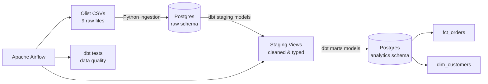

# E-Commerce Analytics Pipeline

An end-to-end ELT data pipeline that ingests raw e-commerce transaction data, transforms it into analytics-ready tables using dbt, validates data quality with automated tests, and orchestrates the entire workflow with Apache Airflow — all containerized with Docker.

## Architecture

**Pipeline flow:** Airflow triggers a Python script that loads 9 raw CSVs into a Postgres `raw` schema → dbt builds staging views (cleaned, renamed, typed) on top of `raw` → dbt builds mart tables (`fct_orders`, `dim_customers`) on top of staging → dbt tests validate primary key uniqueness, null constraints, and business logic (e.g., spend can't be negative).

## Tech Stack

| Layer | Tool | Purpose |
|---|---|---|
| Storage | PostgreSQL 15 | Raw landing zone + analytics tables |
| Ingestion | Python (pandas, SQLAlchemy) | CSV → database loading |
| Transformation | dbt-core | SQL-based modeling, testing, documentation |
| Orchestration | Apache Airflow 2.9 | Scheduling, dependency management, retries |
| Infrastructure | Docker Compose | Reproducible local environment |

## Dataset

[Brazilian E-Commerce Public Dataset by Olist](https://www.kaggle.com/datasets/olistbr/brazilian-ecommerce) — ~100K orders (2016-2018) across customers, orders, order items, payments, reviews, products, and sellers.

## Project Structure