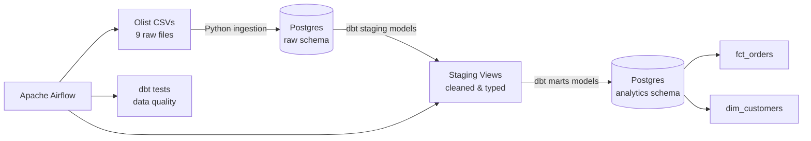

# E-Commerce Analytics Pipeline

An end-to-end ELT data pipeline that ingests raw e-commerce transaction data, transforms it into analytics-ready tables using dbt, validates data quality with automated tests, and orchestrates the entire workflow with Apache Airflow — all containerized with Docker.

## Architecture



**Pipeline flow:** Airflow triggers a Python script that loads 9 raw CSVs into a Postgres `raw` schema → dbt builds staging views (cleaned, renamed, typed) on top of `raw` → dbt builds mart tables (`fct_orders`, `dim_customers`) on top of staging → dbt tests validate primary key uniqueness, null constraints, and business logic (e.g., spend can't be negative).

## Tech Stack

| Layer | Tool | Purpose |
|---|---|---|
| Storage | PostgreSQL 15 | Raw landing zone + analytics tables |
| Ingestion | Python (pandas, SQLAlchemy) | CSV → database loading |
| Transformation | dbt-core | SQL-based modeling, testing, documentation |
| Orchestration | Apache Airflow 2.9 | Scheduling, dependency management, retries |
| Infrastructure | Docker Compose | Reproducible local environment |

## Dataset

[Brazilian E-Commerce Public Dataset by Olist](https://www.kaggle.com/datasets/olistbr/brazilian-ecommerce) — ~100K orders (2016-2018) across customers, orders, order items, payments, reviews, products, and sellers.

## Project Structure

## Data Model

**Staging layer** (`stg_olist__*`): thin views over raw tables — renamed columns, cast types, no business logic.

**Marts layer:**
- `fct_orders` — one row per order: item counts, totals, freight, payment amount, delivery duration
- `dim_customers` — one row per customer: lifetime order count, total spend, first/last order date

## Data Quality

11 automated dbt tests covering:
- Primary key uniqueness and non-null constraints on `order_id` and `customer_id`
- Business rule validation (e.g., `total_spend >= 0`)

## Running Locally

**Prerequisites:** Docker, Docker Compose, WSL2 (if on Windows)

1. Clone the repo and copy env template:
```bash
   cp .env.example .env
```
2. Start all services:
```bash
   docker-compose up -d --build
```
3. Open the Airflow UI at `http://localhost:8080` (login: `admin` / `admin`)
4. Trigger the `ecommerce_pipeline` DAG manually, or wait for its schedule

The DAG runs three tasks in sequence: `load_raw_data` → `dbt_run` → `dbt_test`.

## What I'd Improve Next

- Add an intermediate dbt layer once more marts are added and joins start getting reused
- Add a lightweight dashboard (Streamlit or Metabase) on top of the marts
- Add CI (GitHub Actions) to run `dbt test` automatically on every pull request
- Schedule the DAG on a recurring cadence instead of manual triggers

## Key Engineering Challenges Solved

- Resolved a dependency conflict between dbt-core and Airflow's pinned SQLAlchemy version by aligning package versions against Airflow's official constraints file
- Fixed Postgres `DependentObjectsStillExist` errors by explicitly cascading drops on raw tables before re-ingestion, keeping the pipeline idempotent
- Debugged Docker bind-mount permission issues by redirecting dbt's writable output (logs, compiled artifacts) to container-local paths
- Configured a shared Airflow secret key across webserver and scheduler containers to enable cross-container log retrieval
